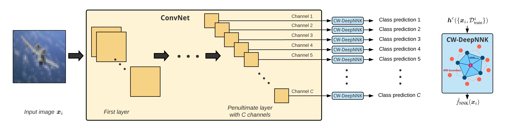

# CW-DeepNNK_Early_Stopping



Early stopping criterion that (i) does not require a validation set, (ii) is based on a task performance metric, and (iii) allows stopping to be reached at different points for each channel.

Python source code for [Channel-Wise Early Stopping without a Validation Set via NNK Polytope Interpolation](https://arxiv.org/abs/2107.12972)

## Code requirements

* Code has been tested for Python 3.8.
* See `requirements.txt` for required pip packages (CPU only). Please install `faiss-gpu` and `tensorflow-gpu` for use with GPU.

## Using CW-DeepNNK

* `main.py` provides an example of how to integrate CW-DeepNNK as an early stopping method in a standard ConvNet training environment in Tensorflow.
* `run_script.bash` contains a set of example commands for using CW-DeepNNK early stopping in training and evaluating the final model.

## Citing this work

```
@misc{bonet2021channelwise,
      title={Channel-Wise Early Stopping without a Validation Set via NNK Polytope Interpolation}, 
      author={David Bonet and Antonio Ortega and Javier Ruiz-Hidalgo and Sarath Shekkizhar},
      year={2021},
      eprint={2107.12972},
      archivePrefix={arXiv},
      primaryClass={cs.LG}
}
```